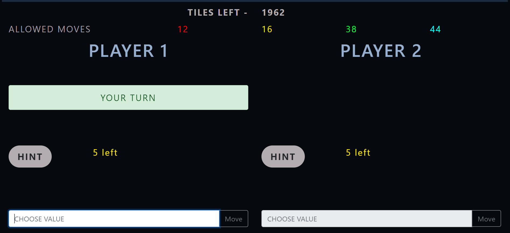

# THIS PROJECT IS ABOUT GAME THEORY

## THIS INCLUDES THREE TYPE OF GAMES

### SINGLE HEAP

THIS IS TWO PLAYESR GAME IN THIS ONLY ONE HEAP IS GIVEN AND YOU CAN REMOVE THE ALLOWED NUMBERS OF TILES WHICH WAS GIVEN THE PLAYER WHO CANNOT REMOVE ANY TILE WILL LOOSE BOTH PLAYERS WILL PLAY ALTERNATIVELY

### MULTI HEAP

THIS IS TWO PLAYERS GAME IN THIS MORE THAN ONE HEAPS ARE GIVEN AND YOU CAN REMOVE ANY NUMBERS OF TILES FROM ANY HEAP (WHICH HAS TILES) THE PLAYER WHO CANNOT REMOVE ANY TILE WILL LOOSE BOTH PLAYERS WILL PLAY ALTERNATIVELY

### GRID

THIS IS TWO PLAYERS GAME IN THIS A GRID IS GIVEN AND YOU NEED TO REACH TO TOP-LEFT FROM BOTTOM-RIGHT
BOTH PLAYERS WILL PLAY ALTERNATIVELY

- THE GRID HAS CERTAIN OBSTACLE WHICH CANNOT BE CROSSED

- PLAYER CAN ONLY MOVE LEFT OR TOP
